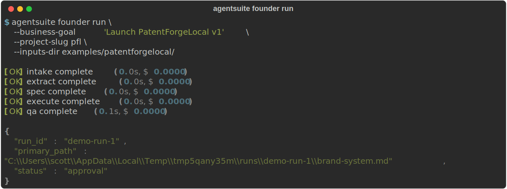
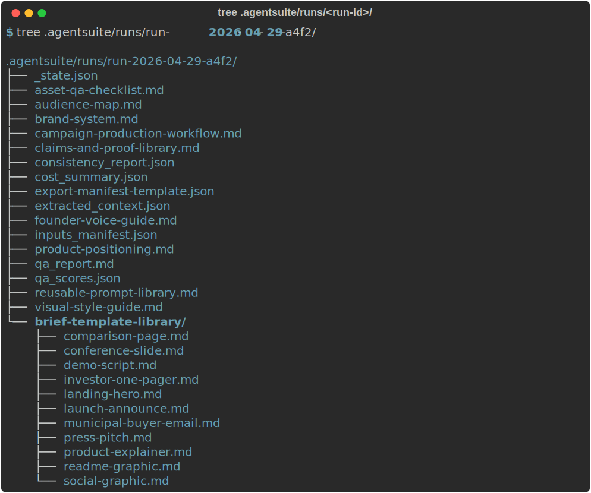
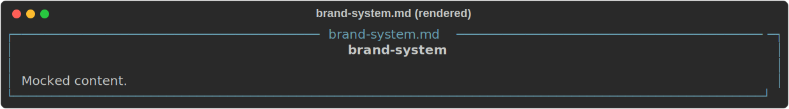
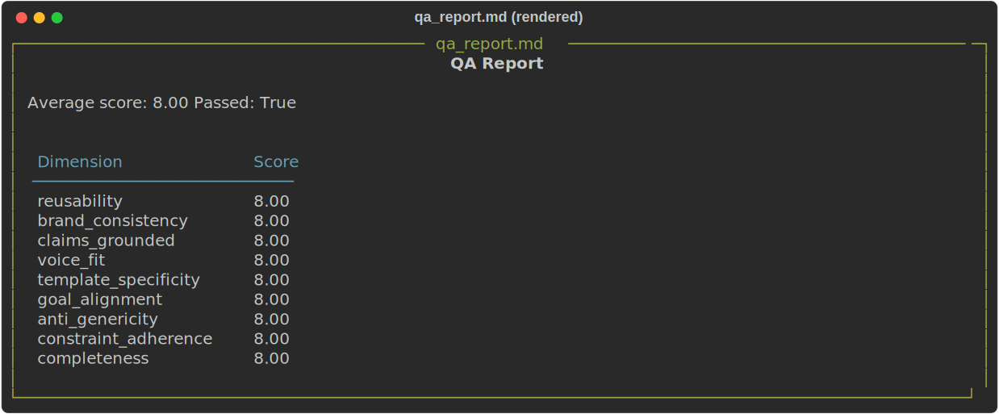
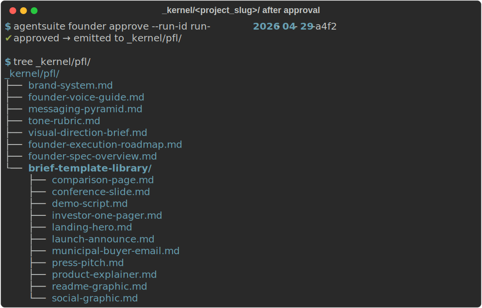
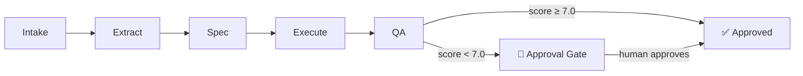

# AgentSuite

> Seven role-specific reasoning agents that turn vague intent into precise operating artifacts.
>
> **v1.0.11** — Specification Kernel + Founder · Design · Product · Engineering · Marketing · Trust/Risk · CIO Agents



AgentSuite is a Python package and MCP server. It exposes role-specific agents (Founder, Design, Product, Engineering, Marketing, Trust/Risk, and CIO shipped) that take loose human intent and produce structured, reusable artifacts: brand systems, brief libraries, voice guides, prompt templates, engineering specs, IT strategies, and more.

The agents are reasoning agents, not content generators. Output is a reusable system, not a one-off asset.

## Who this is for

Technical founders and developers who build inside AI-native IDEs — Claude Code, Cowork, Codex, Google Antigravity — and are frustrated that every new session starts from scratch. You know your way around a terminal. You have an API key. You want structured, reusable output, not a one-off generation you'll never find again.

## Why AgentSuite

**The problem:** AI IDEs are great at generating content but terrible at remembering it. Every session re-introduces context, re-drifts on voice, re-argues decisions that were settled last week.

**What AgentSuite does:** acts as the operating layer between your intent and your IDE. Seven role-specific agents each walk a five-stage pipeline (intake → extract → spec → execute → qa), persist artifacts to disk, and promote approved output into a `_kernel/` that every subsequent run — and every downstream agent — consumes. Your brand system, your engineering decisions, your risk posture: written once, versioned, reused.

**What makes it different:** the *system around* generation, not the generation itself. Every artifact is on disk, QA-scored, and reusable across sessions. Provider-agnostic (Anthropic / OpenAI / Gemini / local Ollama). MCP-native — agents surface as tools in Claude Code, Cowork, Codex, Google Antigravity, or any MCP-compatible IDE without a separate server.

## Install

<!-- install:start -->
```bash
# Install with your preferred provider:
pip install "agentsuite[anthropic] @ git+https://github.com/scottconverse/AgentSuite.git"   # Anthropic Claude
pip install "agentsuite[openai] @ git+https://github.com/scottconverse/AgentSuite.git"      # OpenAI GPT
pip install "agentsuite[gemini] @ git+https://github.com/scottconverse/AgentSuite.git"      # Google Gemini
pip install "agentsuite[ollama] @ git+https://github.com/scottconverse/AgentSuite.git"      # Local Ollama daemon

# Install everything:
pip install "agentsuite[all] @ git+https://github.com/scottconverse/AgentSuite.git"

# or, no install (MCP only):
uvx --from "agentsuite[mcp] @ git+https://github.com/scottconverse/AgentSuite.git" agentsuite-mcp
```
<!-- install:end -->

> AgentSuite is distributed from GitHub only — there is no PyPI publication.

Requirements: Python 3.11+. Either an API key (`ANTHROPIC_API_KEY`, `OPENAI_API_KEY`, or `GEMINI_API_KEY` / `GOOGLE_API_KEY`) OR a local Ollama daemon running at `localhost:11434`.

## Quick start (CLI)

```bash
export ANTHROPIC_API_KEY=sk-ant-...
agentsuite founder run \
  --business-goal "Launch PatentForgeLocal v1" \
  --project-slug pfl \
  --inputs-dir ./examples/patentforgelocal
```

The agent walks five stages, writes 26 artifacts under `.agentsuite/runs/<run-id>/`, and pauses at the approval gate. Review `brand-system.md` + `qa_report.md`, then:

```bash
agentsuite founder approve --run-id <run-id> --approver you --project-slug pfl
```

Approved artifacts get promoted to `.agentsuite/_kernel/pfl/` for downstream agents.

## Quick start (Local LLM — Ollama)

Run AgentSuite entirely offline against a local Gemma 4 model. Zero cost, no API keys required.

```bash
# Install Ollama (https://ollama.ai) if not already installed, then pull a Gemma 4 model:
ollama pull gemma4:e4b      # recommended: ~5 GB, balanced quality

# Optional alternatives:
#   ollama pull gemma4:e2b    # ~3 GB, laptop-class (faster, less capable)
#   ollama pull gemma4:26b-moe # ~15 GB, high-end workstation (slowest, best quality)

# Make sure the daemon is running:
ollama serve &

# Then run AgentSuite as usual — the resolver auto-detects the daemon when no API keys are set:
agentsuite founder run \
  --business-goal "Launch My Product v1" \
  --project-slug my-product \
  --inputs-dir ./my-brand-inputs
```

You can also pin Ollama explicitly via `AGENTSUITE_LLM_PROVIDER=ollama` regardless of which API keys you have set.

## Quick start (MCP — Codex)

Add to `~/.codex/mcp.toml`:

```toml
[servers.agentsuite]
command = "uvx"
args = ["agentsuite-mcp"]

[servers.agentsuite.env]
AGENTSUITE_ENABLED_AGENTS = "founder,design,product,engineering,marketing,trust-risk,cio"
```

Restart Codex. Tools `agentsuite_founder_run`, `agentsuite_founder_approve`, `agentsuite_founder_get_status`, `agentsuite_founder_list_runs`, `agentsuite_founder_resume`, plus the cross-agent `agentsuite_list_agents`, `agentsuite_kernel_artifacts`, `agentsuite_cost_report` are now callable.

## Quick start (MCP — Claude Code / Cowork)

Add to project-root `.mcp.json`:

```json
{
  "mcpServers": {
    "agentsuite": {
      "command": "uvx",
      "args": ["agentsuite-mcp"],
      "env": {"AGENTSUITE_ENABLED_AGENTS": "founder,design,product,engineering,marketing,trust-risk,cio"}
    }
  }
}
```

Restart the harness.

## Quick start (MCP — Google Antigravity)

AgentSuite is MCP-compatible with Google Antigravity. Refer to the Antigravity documentation for the MCP server configuration format, then point it at `uvx agentsuite-mcp` with `AGENTSUITE_ENABLED_AGENTS` set to your desired agent list.

## What the agents produce

### Founder agent — 26 artifacts per run:

| Stage | Artifacts |
|---|---|
| 1 intake | `inputs_manifest.json` |
| 2 extract | `extracted_context.json` |
| 3 spec | `brand-system.md`, `founder-voice-guide.md`, `product-positioning.md`, `audience-map.md`, `claims-and-proof-library.md`, `visual-style-guide.md`, `campaign-production-workflow.md`, `asset-qa-checklist.md`, `reusable-prompt-library.md`, `consistency_report.json` |
| 4 execute | `brief-template-library/` (11 brief templates) + `export-manifest-template.json` |
| 5 qa | `qa_report.md`, `qa_scores.json` |
| state | `_state.json`, `_meta.json` |

On `agentsuite_founder_approve`, the spec artifacts + brief-template-library are promoted to `.agentsuite/_kernel/<project_slug>/` for use by downstream agents.

### Design agent — see CHANGELOG for artifact list.

### Product agent — see CHANGELOG for artifact list.

### Engineering agent — 17 artifacts per run:

| Stage | Artifacts |
|---|---|
| 3 spec | `architecture-decision-record.md`, `system-design.md`, `api-spec.md`, `data-model.md`, `security-review.md`, `deployment-plan.md`, `runbook.md`, `tech-debt-register.md`, `performance-requirements.md` |
| 4 execute | `brief-template-library/` (8 brief templates: sprint ticket, code review checklist, incident report, capacity plan, on-call handoff, release checklist, postmortem, vendor evaluation) |
| 5 qa | `qa_report.md`, `qa_scores.json` |
| state | `_state.json`, `_meta.json` |

### Trust/Risk agent (v0.6.0) — 17 artifacts per run:

Input: `product_name`, `risk_domain`, `stakeholder_context` (plus optional `regulatory_context`, `threat_model_scope`, `compliance_frameworks`).

| Stage | Artifacts |
|---|---|
| 3 spec | `threat-model.md`, `risk-register.md`, `control-framework.md`, `incident-response-plan.md`, `compliance-matrix.md`, `vendor-risk-assessment.md`, `security-policy.md`, `audit-readiness-report.md`, `residual-risk-acceptance.md`, `consistency_report.json` |
| 4 execute | `brief-template-library/` (8 brief templates: breach-notification, executive-risk-summary, penetration-test-brief, remediation-tracker, risk-acceptance-form, security-awareness-brief, tabletop-exercise-scenario, vendor-security-questionnaire) + `export-manifest-template.json` |
| 5 qa | `qa_report.md`, `qa_scores.json` |
| state | `_state.json`, `_meta.json` |

Primary artifact: `threat-model.md`. On `agentsuite_trust_risk_approve`, all spec artifacts and brief templates are promoted to `.agentsuite/_kernel/<project_slug>/`.

### CIO agent (v0.7.0) — 17 artifacts per run:

Input: `organization_name`, `strategic_priorities`, `it_maturity_level`.

| Stage | Artifacts |
|---|---|
| 3 spec | `it-strategy.md`, `technology-roadmap.md`, `vendor-portfolio.md`, `digital-transformation-plan.md`, `it-governance-framework.md`, `enterprise-architecture.md`, `budget-allocation-model.md`, `workforce-development-plan.md`, `it-risk-appetite-statement.md`, `consistency_report.json` |
| 4 execute | `brief-template-library/` (8 brief templates: board-technology-briefing, it-steering-committee-agenda, vendor-review-summary, project-portfolio-status, digital-initiative-proposal, it-investment-case, technology-modernization-pitch, quarterly-it-review) + `export-manifest-template.json` |
| 5 qa | `qa_report.md`, `qa_scores.json` |
| state | `_state.json`, `_meta.json` |

Primary artifact: `it-strategy.md`. On `agentsuite_cio_approve`, all spec artifacts and brief templates are promoted to `.agentsuite/_kernel/<project_slug>/`.

## Quick start (Python SDK)

Use AgentSuite programmatically — no CLI required:

```python
from pathlib import Path
from agentsuite import FounderAgent, resolve_provider
from agentsuite.agents.founder.input_schema import FounderAgentInput
from agentsuite.kernel.schema import Constraints

agent = FounderAgent(output_root=Path(".agentsuite"), llm=resolve_provider())
state = agent.run(
    request=FounderAgentInput(
        agent_name="founder",
        role_domain="product",
        user_request="My startup builds X for Y",
        business_goal="Validate and launch",
        project_slug="my-startup",
        constraints=Constraints(),
    ),
    run_id="my-run",
)
print(state.stage)   # "approval"
```

`resolve_provider()` auto-detects your API key from environment variables. See [Configuration](#configuration) for the full list of env vars.

## Chaining agents (pipeline)

Run multiple agents back-to-back — each agent's output feeds into the next run's context via the shared `_kernel/<project_slug>/` directory.

**CLI — headless (auto-approve each step):**

```bash
agentsuite pipeline run \
  --agents founder,design,product \
  --project-slug my-startup \
  --business-goal "Launch a B2B invoicing tool for freelancers" \
  --auto-approve
```

**CLI — with approval gates (default):**

```bash
# Step 1: start the pipeline (pauses after founder)
agentsuite pipeline run \
  --agents founder,design,product \
  --project-slug my-startup \
  --business-goal "Launch a B2B invoicing tool for freelancers"
# Prints: pipeline-id: pipeline-20260501T120000-abc123

# Step 2: review founder output, then approve
agentsuite pipeline approve --pipeline-id pipeline-20260501T120000-abc123

# Repeat approve for each subsequent agent, or check status at any time:
agentsuite pipeline status --pipeline-id pipeline-20260501T120000-abc123
```

**Agents requiring extra inputs** (engineering, trust_risk, cio) need a JSON file passed via `--agent-inputs`:

```json
// agent-inputs.json
{
  "engineering": {
    "tech_stack": "Python + FastAPI",
    "scale_requirements": "1k RPM, 99.9% uptime"
  }
}
```

```bash
agentsuite pipeline run \
  --agents founder,engineering \
  --project-slug my-startup \
  --business-goal "Launch a B2B invoicing tool" \
  --agent-inputs agent-inputs.json \
  --auto-approve
```

**MCP** (Claude Code / Cowork / Codex / Antigravity): use `agentsuite_pipeline_run`, `agentsuite_pipeline_approve`, `agentsuite_pipeline_status`.

## Configuration

| Env var | Default | Purpose |
|---|---|---|
| `AGENTSUITE_ENABLED_AGENTS` | `founder` | Comma-separated agent names to expose (e.g. `founder,design,product,engineering`) |
| `AGENTSUITE_OUTPUT_DIR` | `.agentsuite` | Where artifacts are written |
| `AGENTSUITE_LLM_PROVIDER` | (auto-detect) | Force `anthropic`, `openai`, `gemini`, or `ollama` |
| `AGENTSUITE_COST_CAP_USD` | `5.0` | Hard kill cap per run |
| `AGENTSUITE_EXPOSE_STAGES` | (off) | Set `true` to expose `founder_intake`/`extract`/`spec`/`execute`/`qa` as MCP tools |

## Screenshots and sample output

| | |
|---|---|
|  | A real `agentsuite founder run` end-to-end. Five stages, JSON summary. |
|  | The 14-artifact run directory after success. |
|  | `brand-system.md` rendered. |
|  | `qa_report.md` rendered. |
|  | `_kernel/<project_slug>/` after approval. |

Browse a complete sample run on GitHub at [`examples/sample-output/founder/`](examples/sample-output/founder/) — every artifact a Founder run produces, with the same on-disk shape as a live run; the free-text bodies are deterministic-mock scaffold (see the directory's README for what's authentic vs. scaffold).

## Architecture

AgentSuite runs every request through a five-stage pipeline:



Each stage is handled by the same kernel regardless of which agent is running. The QA stage scores output against a 9-dimension rubric; runs scoring below 7.0 enter an approval gate before artifacts are written.

```
                    ┌───────────────┐
                    │  Harness      │  (Codex / Claude Code / Cowork)
                    └─────┬─────────┘
                          │ stdio MCP
                    ┌─────▼─────────┐
                    │ agentsuite-mcp│
                    └─────┬─────────┘
                          │
              ┌───────────┴───────────┐
              │                       │
        ┌─────▼──────┐         ┌──────▼──────┐
        │  Kernel    │◄────────│ FounderAgent│
        │            │         │             │
        │ schema/    │         │ stages/     │
        │ qa/        │         │ rubric.py   │
        │ cost/      │         │ templates/  │
        │ artifacts/ │         │ prompts/    │
        │ approval/  │         └─────────────┘
        │ base_agent │
        └────────────┘
```

Full architecture diagram with all agents: see `docs/README-FULL.pdf`.

## Status

**Shipped:**
- v0.1.0 — Specification Kernel + Founder Agent
- v0.2.0 — Design Agent (brief generation, brand QA scoring)
- v0.3.0 — Product Agent (PM intent → UI spec → coding handoff)
- v0.4.0 — Engineering Agent (architecture decisions, system design, API specs, security review, deployment, runbook, tech-debt register, performance requirements)
- v0.5.0 — Marketing Agent (campaign brief, audience profile, messaging framework, content calendar, channel strategy, SEO keyword plan, competitive positioning, launch plan, measurement framework)
- v0.6.0 — Trust/Risk Agent (threat model, risk register, control framework, incident response plan, compliance matrix, vendor risk assessment, security policy, audit readiness report, residual risk acceptance)
- v0.7.0 — CIO Agent (IT strategy, technology roadmap, vendor portfolio, digital transformation plan, IT governance framework, enterprise architecture, budget allocation model, workforce development plan, IT risk appetite statement)
- v0.8.0 — path-traversal validation, MCP tool naming fixes, RetryingLLMProvider hardening
- v0.9.0–v0.9.1 — engineering hardening sprint (676 tests, 7 ADRs, resume idempotency contract)
- v1.0.0–v1.0.8 — Sprint 2 audit + remediation; 1066 tests green; cleanroom PASS
- v1.0.9 — Sprint 3 audit + remediation; 12 Nit findings resolved; full 4-sprint audit cycle complete
- v1.0.10 — Sprint 4 — 12 Nit findings resolved; full 57-finding audit cycle complete

**Roadmap (v1.1.x candidates):**
- Multi-agent pipelines (chain agents end-to-end)
- Per-day cost cap
- 8th agent TBD

## Documentation

- [USER-MANUAL.md](USER-MANUAL.md) — plain-language walkthrough
- [README-FULL.pdf](docs/README-FULL.pdf) — full reference with architecture diagrams
- [CONTRIBUTING.md](CONTRIBUTING.md) — dev setup + agent-implementation guide
- [CHANGELOG.md](CHANGELOG.md) — release notes

## License

MIT — see [LICENSE](LICENSE).